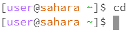
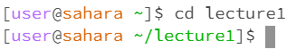
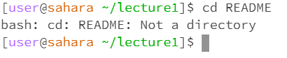
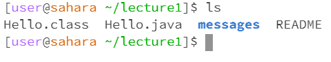
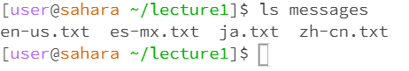
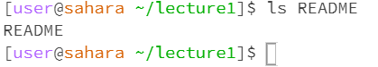
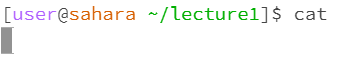
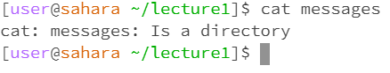
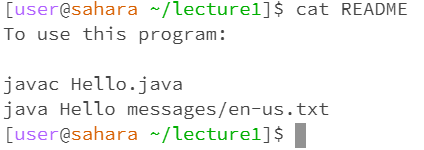

# Lab Report 1
   
  When the command run, the directory was the main workspace. The code changes the working directory to the main workspace. It's not an error. 
  
    
  When the command run, the directory was the main workspace, and the code changes the directory to folder lecture1. It's not an error
  
   
  The working directory was folder lecture1. The code returns an error, as cd can only follow with directory
  
   
  Here the working directory is lecture1. The code shows all files and folders under this directory. It's not an error.

   
  Here the working directory is lecture1. The code shows all files and folders under directory messages. It's not an error.

   
  Here the working directory is lecture1. The code returns the name of the file. It's because ls lists files in the target, and here's only the file itself as target. It's not an error.

   
  Here the working directory is lecture1. The code runs and shows nothing.

   
  Here the working directory is lecture1. The code returns an error report as cat shows contents in a file, while our target is a directory.

   
  Here the working directory is messages. The code shows contents of file ja.txt. It's not an error.
