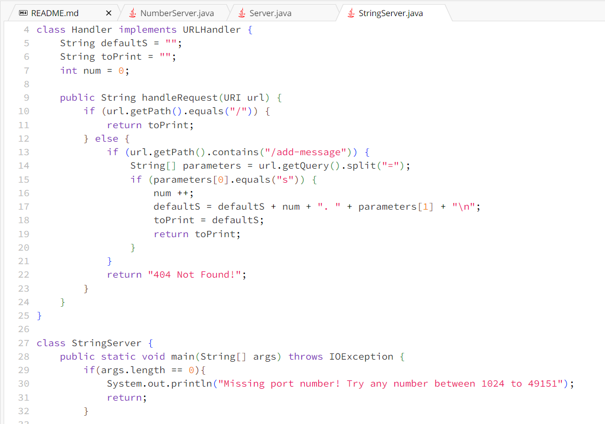
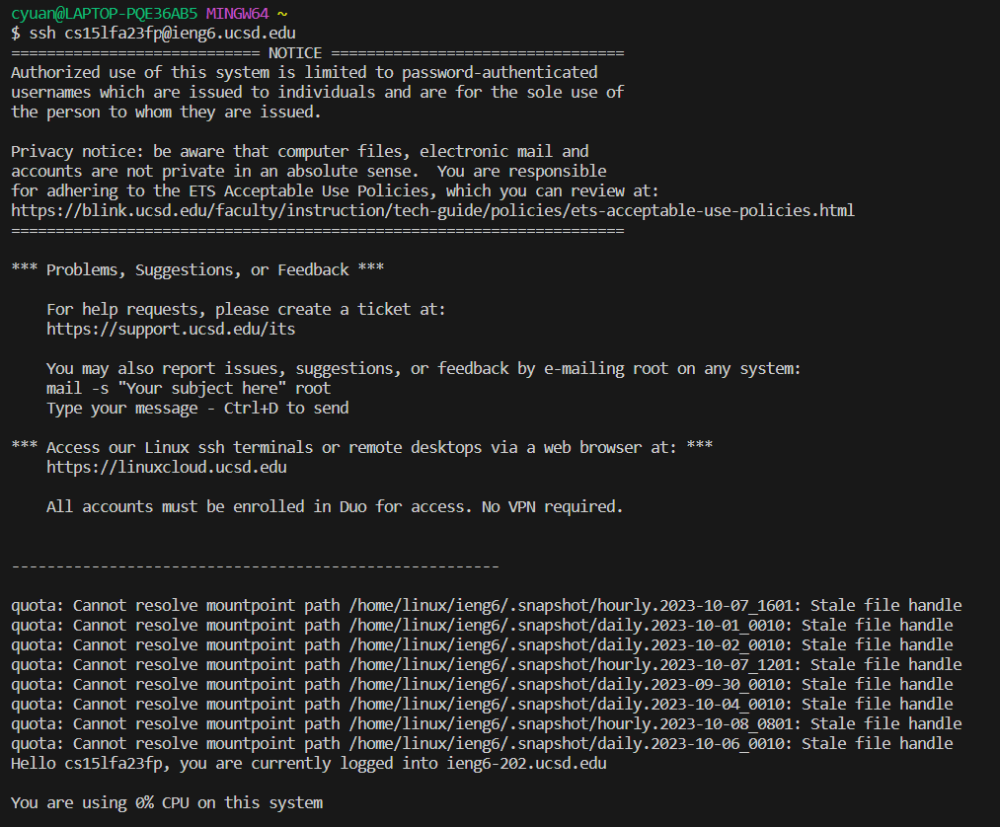

# Lab Report 2
## Part 1
 
    Here is the code of StringServer 

 
    This is the result of using `/add-message?s=Hello`. Method `String HandleRequest` is called. `/add-message?s=Hello` is the relevant argument, and `defaultS`is the relevant field. It's value is "" at first. It's value now is "1. Hello\n"

 
        This is the result of using `/add-message?s=How are you`. Method `String HandleRequest` is called. `/add-message?s=How are you` is the relevant argument, and `defaultS`is the relevant field. It's value is "1. Hello\n" at first. It's value now is "1. Hello\n2. How are you\n"
## Part 2
 Local Path 
 Server Path 
 Interaction
## Part3
In these two weeks' labs, I know how to make a server, and change values just with URLs.
