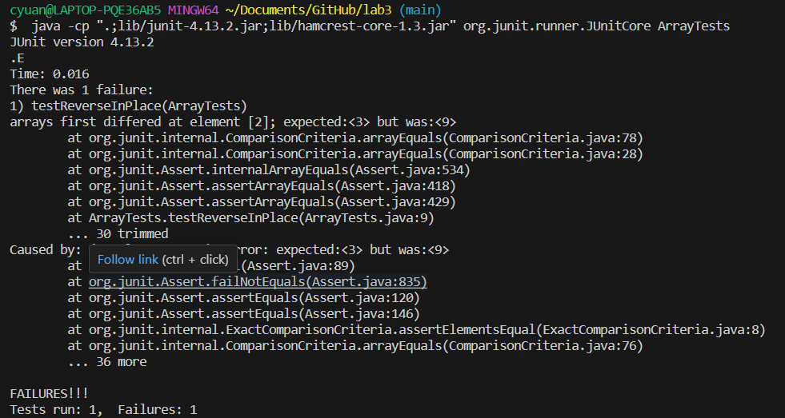

# Lab Report 3
## Part 1
__failure-inducing input__
```
$  java -cp ".;lib/junit-4.13.2.jar;lib/hamcrest-core-1.3.jar" org.junit.runner.JUnitCore ArrayTests.java
JUnit version 4.13.2
.E
Time: 0.003
There was 1 failure:
1) initializationError(org.junit.runner.JUnitCommandLineParseResult)
java.lang.IllegalArgumentException: Could not find class [ArrayTests.java]
        at org.junit.runner.JUnitCommandLineParseResult.parseParameters(JUnitCommandLineParseResult.java:100)
        at org.junit.runner.JUnitCommandLineParseResult.parseArgs(JUnitCommandLineParseResult.java:50)
        at org.junit.runner.JUnitCommandLineParseResult.parse(JUnitCommandLineParseResult.java:44)
        at org.junit.runner.JUnitCore.runMain(JUnitCore.java:72)
        at org.junit.runner.JUnitCore.main(JUnitCore.java:36)
Caused by: java.lang.ClassNotFoundException: ArrayTests.java
        at java.base/jdk.internal.loader.BuiltinClassLoader.loadClass(BuiltinClassLoader.java:641)
        at java.base/jdk.internal.loader.ClassLoaders$AppClassLoader.loadClass(ClassLoaders.java:188)
        at java.base/java.lang.ClassLoader.loadClass(ClassLoader.java:521)
        at java.base/java.lang.Class.forName0(Native Method)
        at java.base/java.lang.Class.forName(Class.java:495)
        at java.base/java.lang.Class.forName(Class.java:474)
        at org.junit.internal.Classes.getClass(Classes.java:42)
        at org.junit.internal.Classes.getClass(Classes.java:27)
        at org.junit.runner.JUnitCommandLineParseResult.parseParameters(JUnitCommandLineParseResult.java:98)
        ... 4 more

FAILURES!!!
Tests run: 1,  Failures: 1
```
__input that doesn’t induce a failure__
```
$  java -cp ".;lib/junit-4.13.2.jar;lib/hamcrest-core-1.3.jar" org.junit.runner.JUnitCore ArrayTests
JUnit version 4.13.2
..
Time: 0.013

OK (2 tests)
```
__symptom__
<br>
__before-and-after code__<br>
__before__
```
  // Changes the input array to be in reversed order
  static void reverseInPlace(int[] arr) {
    for(int i = 0; i < arr.length; i += 1) {
      arr[i] = arr[arr.length - i - 1];
    }
  }
```
__after__
```
  // Changes the input array to be in reversed order
  static void reverseInPlace(int[] arr) {
    for(int i = 0; i < arr.length/2; i += 1) {
      int temp = arr[i];
      arr[i] = arr[arr.length - i - 1];
      arr[arr.length - i - 1] = temp;
    }
  }
```
## Part 2

