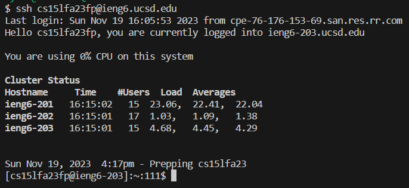
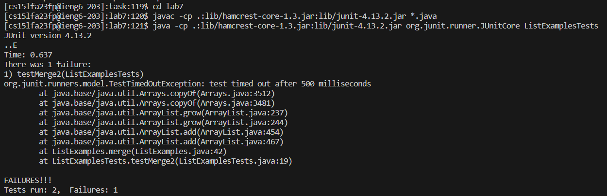
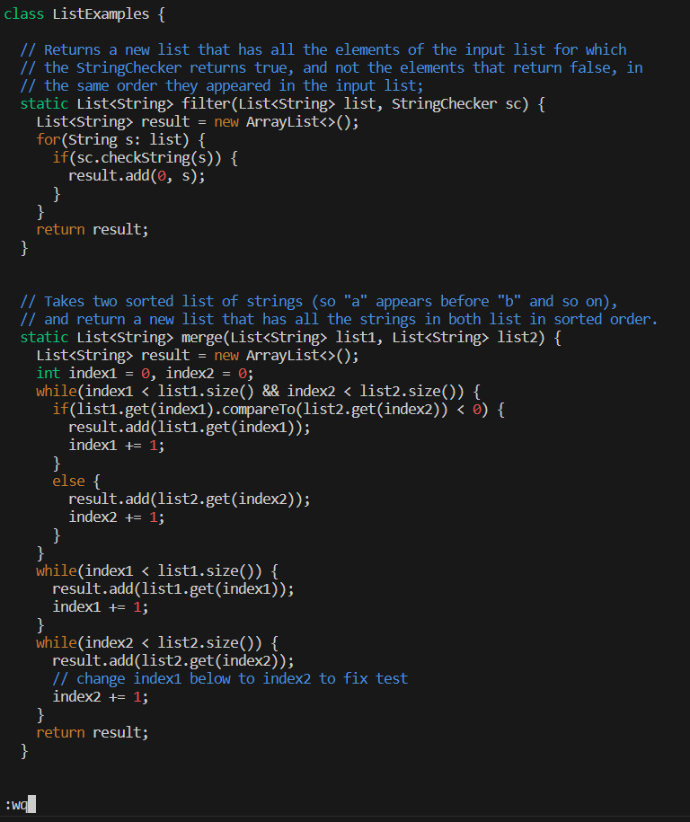
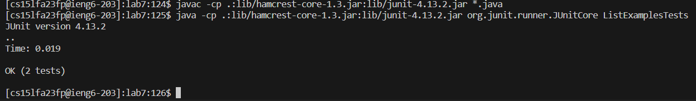
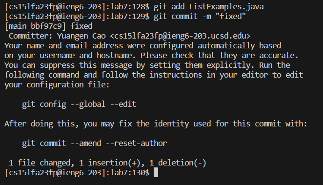

# Lab Report 4
 
Keys pressed: `<up><enter>`. The `ssh cs15lfa23fp@ieng6.ucsd.edu` was 1 up in the search history, so I used up arrow to access it. 
 
Keys pressed: `cd<space>task<enter>``git clone <Ctrl><v><enter>`. It change the working directory into where I want. Then, I use ctrl+v to copy the ssh url and clone it 
 
Keys pressed: `cd<space>lab7<enter>``<up><up><up><up><up><up><up><enter>``<up><up><up><up><up><up><up><enter>`. The `cd lab7` change the working directory. As `javac -cp .:lib/hamcrest-core-1.3.jar:lib/junit-4.13.2.jar *.java` was 7 up in the search history, so I used 7 up arrow to access it. Similar thing happens for `java -cp .:lib/hamcrest-core-1.3.jar:lib/junit-4.13.2.jar org.junit.runner.JUnitCore ListExamplesTests` 
 
Keys pressed: `vim<space>ListExamples.java<enter>`. It opens file `ListExamples.java`. 
 
Keys pressed: `40<enter>jjjexi2<esc>:wq<enter>`. I input 40 to find lines around error parts, and use `jjje` direct to the bug. use `x` to delete and `i` to insert `2`. Finally, use `:wq` to save and quit. 
 
Keys pressed: `<up><up><enter>``<up><up><enter>`. The `javac -cp .:lib/hamcrest-core-1.3.jar:lib/junit-4.13.2.jar *.java` was 2 up in the search history, so I used up arrow to access it. Similarly for `java -cp .:lib/hamcrest-core-1.3.jar:lib/junit-4.13.2.jar org.junit.runner.JUnitCore ListExamplesTests` 
 
Keys pressed: `git<space>add<space>ListExamples.java<enter>``git<space>commit<space>-m<space>"fixed"`. Finally, use the `git` codes to save the changes and commit.
