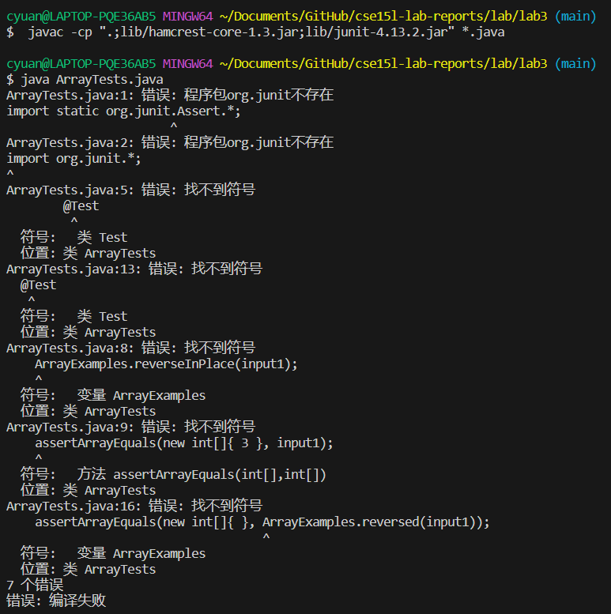
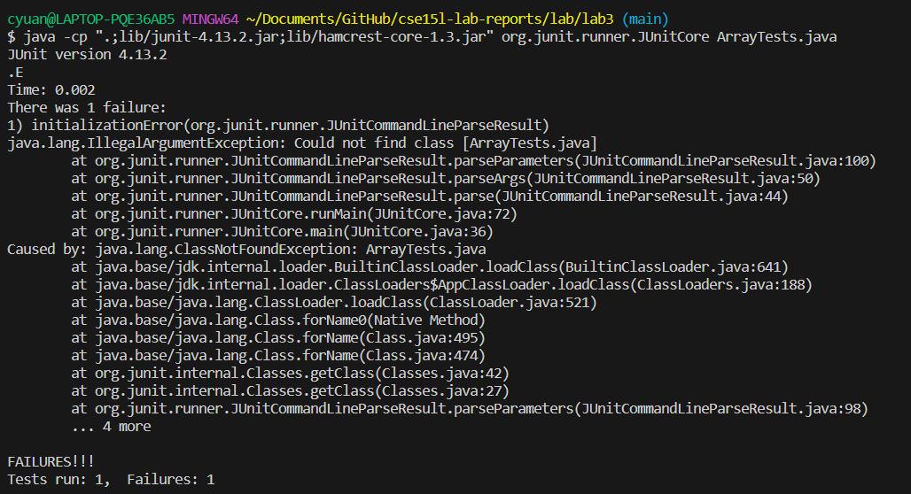

# Lab Report 5
## Part 1
1. Anonymous student: I'm facing a confusing issue. I'm able to compile the java program, but I'm not able run it. I have no idea about what happens.<br>
<br>
2. TA response: I think your question can be answered with course website. Try to find the difference between your code and the example on course website.<br>
3. Anonymous student: I think I know what's wrong. I need to tell the computer the class path in command lines or it will show error. Now it can  run and give me wanted output.
<br>
The structure of the directory is :<br>
```
ArrayExamples.class  ArrayTests.class  FileExample.class  lib/              LinkedListExample.java  ListExamples.java  StringChecker.class
ArrayExamples.java   ArrayTests.java   FileExample.java   LinkedList.class  ListExamples.class      Node.class
```
The wrong command line is :<br>
`$ java ArrayTests.java`<br>
The edition: input the classpath after command java, and tun the junit as well as the test files in command lines.<br>
As it's an compile error, not about files themselves, the bug report is the wanted result, so the inside of codes are not important in this situation.
## Part 2
I learned a lot of interesting things in the second half of the course. The most interesting thing for me is vim. Using vim editing files just need command lines, and this is strange and novel for me. I used to think the only way to edit these files is using some software like VS Code. Vim is just a new way to do similar thing, and it's really special and interesting for me.
